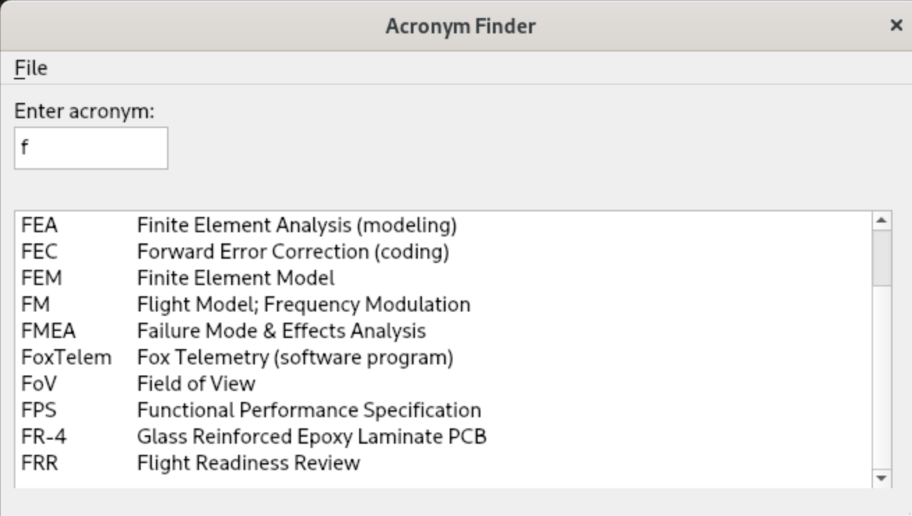

# Acronyms

## Installation

The following assumes `python` is a recent version > 3.7. If not you might
have to use `python3` and `pip3` instead `python` and `pip` below.

Start by creating a virtual environment.

```
python -m venv ./venv
```

Then activate the environment

```
source venv/bin/activate
```

On Windows run

```
venv\Scripts\activate.bat
```

Next install `qt5`

```
(venv) $ pip install pyqt5 pyqt5-tools
```

If UI changes are needed fire up the Qt Designer with `./design.sh`, save changes
and regenerate main_window_ui.py by running `make.sh`.

# Run

To run the application simply do `./app.py`



Just start typing the letters of the acronym into the text box.
